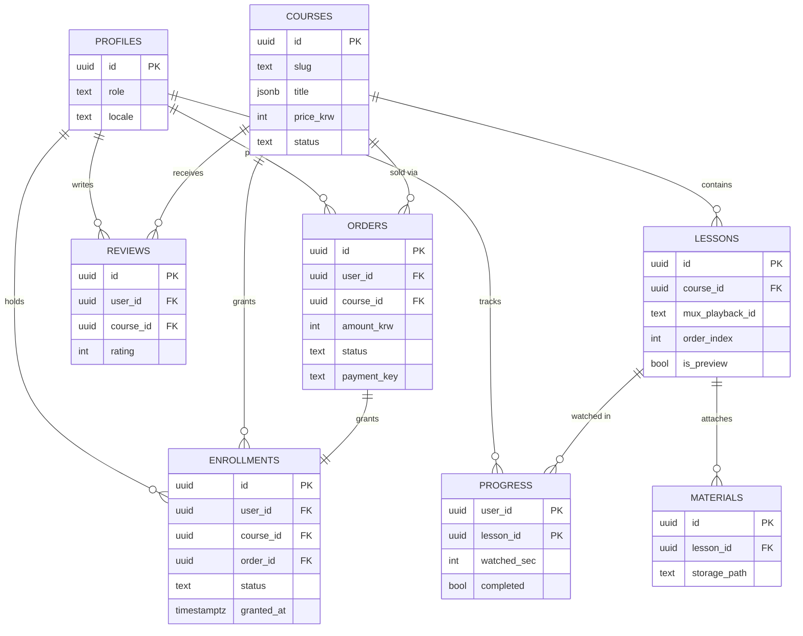

# 베이킹 온라인 클래스 플랫폼 DBSchema

> **버전**: v1.0
> **작성일**: 2026-06-08
> **PRD 참조**: 베이킹 온라인 클래스 플랫폼 PRD v1.1
> **TechSpec 참조**: 베이킹 온라인 클래스 플랫폼 TechSpec v1.1
> **DBMS**: PostgreSQL 15.x (Supabase managed)
> **상태**: Draft

---

## §1. Entity Inventory

### 1.1 Tables
| ID | 테이블명 | 도메인 | 설명 | PRD 참조 | TS 참조 |
|----|---------|--------|------|---------|---------|
| DB-T-01 | `profiles` | Identity | auth.users 확장 프로필 + role | PRD-U-01,02,03 | TS-API-01, TS-SEC-01 |
| DB-T-02 | `courses` | Catalog | 클래스(상품) 단위 | PRD-F-02, PRD-F-08 | TS-API-01, TS-API-06, TS-COMP-01 |
| DB-T-03 | `lessons` | Catalog | 차시(영상) | PRD-F-02, PRD-F-06 | TS-API-02, TS-COMP-05 |
| DB-T-04 | `materials` | Catalog | 레시피·재료 PDF 자료 | PRD-F-09 | TS-API-13, TS-COMP-07 |
| DB-T-05 | `orders` | Commerce | 결제 주문(트랜잭션) | PRD-F-04 | TS-API-10,11, TS-COMP-03 |
| DB-T-06 | `enrollments` | Commerce | 영구 수강권(접근 권한) | PRD-F-05 | TS-API-03, TS-COMP-04 |
| DB-T-07 | `progress` | Activity | 차시별 시청 진도 | PRD-F-07 | TS-API-04, TS-COMP-05 |
| DB-T-08 | `reviews` | Activity | 후기·평점 | PRD-F-10 | TS-API-05, TS-COMP-08 |

### 1.2 Views
| ID | 뷰명 | 기반 테이블 | 용도 | PRD 참조 |
|----|------|------------|------|---------|
| DB-V-01 | `admin_course_sales` | orders, enrollments | 운영 대시보드 매출·수강 집계 | PRD-F-11 |

### 1.3 Enums / Reference Data
| 항목 | 값 | 사용처 |
|------|-----|--------|
| `user_role` | `'student','admin'` | DB-T-01 |
| `course_status` | `'draft','published'` | DB-T-02 |
| `order_status` | `'pending','paid','failed','canceled','refunded'` | DB-T-05 |
| `enrollment_status` | `'active','refunded'` | DB-T-06 |
| `locale` (i18n 키) | `'ko','en'` (확장: `'zh-CN'`) | DB-T-02,03 jsonb 키 |

> 열거형은 모두 `text` + CHECK constraint로 구현(확장 용이). 다국어 텍스트는 `jsonb`로 `{"ko": "...", "en": "..."}` 형태 저장(PRD-F-01).

---

## §2. Table Definitions

### DB-T-01: `profiles`
> **PRD 참조**: PRD-U-01, PRD-U-02, PRD-U-03 | **TS 참조**: TS-API-01, TS-SEC-01

**설명**: Supabase `auth.users`를 확장하는 프로필 테이블. 수강생/운영자 역할 구분.

**컬럼**
| ID | 컬럼명 | 타입 | NULL | 기본값 | 설명 |
|----|--------|------|------|--------|------|
| C1 | `id` | uuid | NOT NULL | - | PK, FK → auth.users.id |
| C2 | `display_name` | text | NULL | - | 표시 이름 |
| C3 | `avatar_url` | text | NULL | - | 프로필 이미지 |
| C4 | `role` | text | NOT NULL | `'student'` | 역할 |
| C5 | `locale` | text | NOT NULL | `'ko'` | 기본 언어 |
| C6 | `created_at` | timestamptz | NOT NULL | `now()` | |
| C7 | `updated_at` | timestamptz | NOT NULL | `now()` | |

**제약**
- `profiles_pk`: PRIMARY KEY (`id`)
- `profiles_id_fk`: FOREIGN KEY (`id`) REFERENCES `auth.users(id)` ON DELETE CASCADE
- `profiles_role_check`: CHECK (`role` IN (`'student','admin'`))
- `profiles_locale_check`: CHECK (`locale` IN (`'ko','en','zh-CN'`))

**인덱스**
| ID | 컬럼 | 타입 | 이유 |
|----|------|------|------|
| DB-IDX-01 | `(id)` | PK | 자동 |

**RLS** (`policy_pattern: public-read + owner-only`)
```sql
alter table public.profiles enable row level security;

create policy "profiles_select_public" on public.profiles
  for select using (true);

create policy "profiles_update_self" on public.profiles
  for update using (id = auth.uid()) with check (id = auth.uid());
```

**트리거**: `DB-TRG-AU` 적용 / 신규 가입 시 `DB-TRG-01`로 자동 생성.

**비고**: `role`은 사용자가 직접 변경 불가(업데이트 정책에서 role 변경은 서버/관리자만 — 운영상 service_role로만 승격).

---

### DB-T-02: `courses`
> **PRD 참조**: PRD-F-02, PRD-F-08 | **TS 참조**: TS-API-01, TS-API-06, TS-COMP-01

**설명**: 판매 단위인 클래스. 단건 구매 대상.

**컬럼**
| ID | 컬럼명 | 타입 | NULL | 기본값 | 설명 |
|----|--------|------|------|--------|------|
| C1 | `id` | uuid | NOT NULL | `gen_random_uuid()` | PK |
| C2 | `slug` | text | NOT NULL | - | URL 식별자 |
| C3 | `title` | jsonb | NOT NULL | `'{}'` | i18n 제목 |
| C4 | `description` | jsonb | NOT NULL | `'{}'` | i18n 설명 |
| C5 | `thumbnail_url` | text | NULL | - | 대표 이미지 |
| C6 | `price_krw` | integer | NOT NULL | `0` | 가격(원, 정수) |
| C7 | `currency` | text | NOT NULL | `'KRW'` | 정산 통화(단일 MID) |
| C8 | `status` | text | NOT NULL | `'draft'` | 공개 상태 |
| C9 | `created_at` | timestamptz | NOT NULL | `now()` | |
| C10 | `updated_at` | timestamptz | NOT NULL | `now()` | |

**제약**
- `courses_pk`: PRIMARY KEY (`id`)
- `courses_slug_uk`: UNIQUE (`slug`)
- `courses_status_check`: CHECK (`status` IN (`'draft','published'`))
- `courses_price_check`: CHECK (`price_krw` >= 0)
- `courses_currency_check`: CHECK (`currency` IN (`'KRW'`)) — v1.1에서 USD 추가 시 확장

**인덱스**
| ID | 컬럼 | 타입 | 이유 |
|----|------|------|------|
| DB-IDX-02 | `(slug)` | unique btree | 상세 페이지 조회 |
| DB-IDX-03 | `(status)` | btree | published 목록 필터 |

**RLS** (`policy_pattern: public-read + role-based`)
```sql
alter table public.courses enable row level security;

create policy "courses_select_published" on public.courses
  for select using (status = 'published' or public.is_admin());

create policy "courses_admin_modify" on public.courses
  for all using (public.is_admin()) with check (public.is_admin());
```

**트리거**: `DB-TRG-AU` 적용.

**비고**: KRW 단일 통화(TS-ADR-05). 대만 화면 "참고가"는 앱 레벨 환산이며 DB엔 KRW만 저장.

---

### DB-T-03: `lessons`
> **PRD 참조**: PRD-F-02, PRD-F-06 | **TS 참조**: TS-API-02, TS-COMP-05

**설명**: 클래스에 속한 차시. Mux 영상 1개에 매핑. **영상 접근 보안의 핵심 테이블**.

**컬럼**
| ID | 컬럼명 | 타입 | NULL | 기본값 | 설명 |
|----|--------|------|------|--------|------|
| C1 | `id` | uuid | NOT NULL | `gen_random_uuid()` | PK |
| C2 | `course_id` | uuid | NOT NULL | - | FK → courses.id |
| C3 | `title` | jsonb | NOT NULL | `'{}'` | i18n 제목 |
| C4 | `mux_asset_id` | text | NULL | - | Mux 에셋 ID(업로드 관리용) |
| C5 | `mux_playback_id` | text | NULL | - | 서명 재생 대상 ID |
| C6 | `order_index` | integer | NOT NULL | `0` | 차시 순서 |
| C7 | `duration_sec` | integer | NULL | - | 재생 길이(초) |
| C8 | `is_preview` | boolean | NOT NULL | `false` | 비구매자 미리보기 허용 |
| C9 | `created_at` | timestamptz | NOT NULL | `now()` | |
| C10 | `updated_at` | timestamptz | NOT NULL | `now()` | |

**제약**
- `lessons_pk`: PRIMARY KEY (`id`)
- `lessons_course_fk`: FOREIGN KEY (`course_id`) REFERENCES `courses(id)` ON DELETE CASCADE
- `lessons_order_uk`: UNIQUE (`course_id`, `order_index`)

**인덱스**
| ID | 컬럼 | 타입 | 이유 |
|----|------|------|------|
| DB-IDX-04 | `(course_id, order_index)` | btree | 커리큘럼 정렬 조회 + FK |

**RLS** (`policy_pattern: 커스텀` — 미리보기 OR 수강권 OR 관리자)
```sql
alter table public.lessons enable row level security;

create policy "lessons_select_guarded" on public.lessons
  for select using (
    is_preview = true
    or public.has_course_access(course_id)   -- DB-F-03
    or public.is_admin()
  );

create policy "lessons_admin_modify" on public.lessons
  for all using (public.is_admin()) with check (public.is_admin());
```

**트리거**: `DB-TRG-AU` 적용.

**비고**: 영상 메타(`mux_playback_id`) 노출 자체를 수강권 보유자로 제한(TS-SEC-02). 실제 재생 토큰은 서버(TS-API-12)에서 추가 검증 후 발급하는 **이중 방어**.

---

### DB-T-04: `materials`
> **PRD 참조**: PRD-F-09 | **TS 참조**: TS-API-13, TS-COMP-07

**설명**: 차시별 레시피·재료표 PDF. Supabase Storage 객체 경로 보관.

**컬럼**
| ID | 컬럼명 | 타입 | NULL | 기본값 | 설명 |
|----|--------|------|------|--------|------|
| C1 | `id` | uuid | NOT NULL | `gen_random_uuid()` | PK |
| C2 | `lesson_id` | uuid | NOT NULL | - | FK → lessons.id |
| C3 | `title` | jsonb | NOT NULL | `'{}'` | i18n 자료명 |
| C4 | `storage_path` | text | NOT NULL | - | Storage 객체 경로 |
| C5 | `created_at` | timestamptz | NOT NULL | `now()` | |
| C6 | `updated_at` | timestamptz | NOT NULL | `now()` | |

**제약**
- `materials_pk`: PRIMARY KEY (`id`)
- `materials_lesson_fk`: FOREIGN KEY (`lesson_id`) REFERENCES `lessons(id)` ON DELETE CASCADE

**인덱스**
| ID | 컬럼 | 타입 | 이유 |
|----|------|------|------|
| DB-IDX-05 | `(lesson_id)` | btree | 차시별 자료 조회 + FK |

**RLS** (`policy_pattern: 커스텀` — 수강권 보유자 OR 관리자)
```sql
alter table public.materials enable row level security;

create policy "materials_select_enrolled" on public.materials
  for select using (
    public.has_course_access((select course_id from lessons where id = lesson_id))
    or public.is_admin()
  );

create policy "materials_admin_modify" on public.materials
  for all using (public.is_admin()) with check (public.is_admin());
```

**트리거**: `DB-TRG-AU` 적용.

**비고**: 다운로드는 서버에서 수강권 확인 후 Storage 서명 URL 발급(TS-API-13). Storage 버킷도 private + RLS 정책 별도 설정.

---

### DB-T-05: `orders`
> **PRD 참조**: PRD-F-04 | **TS 참조**: TS-API-10, TS-API-11, TS-COMP-03

**설명**: 결제 트랜잭션. 수강권 발급과 분리(상태 머신 관리).

**컬럼**
| ID | 컬럼명 | 타입 | NULL | 기본값 | 설명 |
|----|--------|------|------|--------|------|
| C1 | `id` | uuid | NOT NULL | `gen_random_uuid()` | PK |
| C2 | `user_id` | uuid | NOT NULL | - | FK → profiles.id |
| C3 | `course_id` | uuid | NOT NULL | - | FK → courses.id |
| C4 | `amount_krw` | integer | NOT NULL | - | 결제 금액(원) |
| C5 | `currency` | text | NOT NULL | `'KRW'` | 결제 통화 |
| C6 | `status` | text | NOT NULL | `'pending'` | 주문 상태 |
| C7 | `payment_key` | text | NULL | - | TossPayments paymentKey |
| C8 | `payment_method` | text | NULL | - | 카드/간편결제/해외카드 등 |
| C9 | `paid_at` | timestamptz | NULL | - | 승인 시각 |
| C10 | `created_at` | timestamptz | NOT NULL | `now()` | |
| C11 | `updated_at` | timestamptz | NOT NULL | `now()` | |

**제약**
- `orders_pk`: PRIMARY KEY (`id`)
- `orders_user_fk`: FOREIGN KEY (`user_id`) REFERENCES `profiles(id)` ON DELETE CASCADE
- `orders_course_fk`: FOREIGN KEY (`course_id`) REFERENCES `courses(id)` ON DELETE RESTRICT
- `orders_status_check`: CHECK (`status` IN (`'pending','paid','failed','canceled','refunded'`))
- `orders_payment_key_uk`: UNIQUE (`payment_key`) — 중복 승인 방지(멱등)
- `orders_amount_check`: CHECK (`amount_krw` >= 0)

**인덱스**
| ID | 컬럼 | 타입 | 이유 |
|----|------|------|------|
| DB-IDX-06 | `(user_id)` | btree | 내 주문 내역 + FK |
| DB-IDX-07 | `(course_id)` | btree | 매출 집계 + FK |
| DB-IDX-08 | `(payment_key)` | unique btree | Webhook 멱등 조회 |
| DB-IDX-09 | `(status)` | btree | 상태별 운영 조회 |

**RLS** (`policy_pattern: owner-only + role-based`)
```sql
alter table public.orders enable row level security;

create policy "orders_select_own" on public.orders
  for select using (user_id = auth.uid() or public.is_admin());
-- INSERT/UPDATE는 서버(service_role)에서만 수행 → 일반 클라이언트 정책 미부여
```

**트리거**: `DB-TRG-AU` 적용.

**비고**: 금액 검증·상태 전이는 서버(TS-API-10/11)에서만. `course_id`는 RESTRICT로 매출 이력 보존.

---

### DB-T-06: `enrollments`
> **PRD 참조**: PRD-F-05 | **TS 참조**: TS-API-03, TS-API-20, TS-COMP-04

**설명**: **영구 수강권**(만료 없음). 결제 성공 후 발급되는 접근 권한.

**컬럼**
| ID | 컬럼명 | 타입 | NULL | 기본값 | 설명 |
|----|--------|------|------|--------|------|
| C1 | `id` | uuid | NOT NULL | `gen_random_uuid()` | PK |
| C2 | `user_id` | uuid | NOT NULL | - | FK → profiles.id |
| C3 | `course_id` | uuid | NOT NULL | - | FK → courses.id |
| C4 | `order_id` | uuid | NOT NULL | - | FK → orders.id (멱등 기준) |
| C5 | `status` | text | NOT NULL | `'active'` | 수강권 상태 |
| C6 | `granted_at` | timestamptz | NOT NULL | `now()` | 발급 시각(만료 없음) |
| C7 | `created_at` | timestamptz | NOT NULL | `now()` | |
| C8 | `updated_at` | timestamptz | NOT NULL | `now()` | |

**제약**
- `enrollments_pk`: PRIMARY KEY (`id`)
- `enrollments_user_fk`: FOREIGN KEY (`user_id`) REFERENCES `profiles(id)` ON DELETE CASCADE
- `enrollments_course_fk`: FOREIGN KEY (`course_id`) REFERENCES `courses(id)` ON DELETE RESTRICT
- `enrollments_order_fk`: FOREIGN KEY (`order_id`) REFERENCES `orders(id)` ON DELETE RESTRICT
- `enrollments_order_uk`: UNIQUE (`order_id`) — 주문당 1수강권(멱등)
- `enrollments_user_course_uk`: UNIQUE (`user_id`, `course_id`) — 단건 구매: 사용자-클래스 1수강권
- `enrollments_status_check`: CHECK (`status` IN (`'active','refunded'`))

**인덱스**
| ID | 컬럼 | 타입 | 이유 |
|----|------|------|------|
| DB-IDX-10 | `(user_id, course_id)` | unique btree | 접근 확인(has_course_access) + FK |
| DB-IDX-11 | `(course_id)` | btree | 수강생 집계 + FK |
| DB-IDX-12 | `(order_id)` | unique btree | 멱등 발급 |

**RLS** (`policy_pattern: owner-only + role-based`)
```sql
alter table public.enrollments enable row level security;

create policy "enrollments_select_own" on public.enrollments
  for select using (user_id = auth.uid() or public.is_admin());
-- 발급은 grant_enrollment(security definer)/service_role로만
```

**트리거**: `DB-TRG-AU` 적용.

**비고**: 환불 시 `status='refunded'`로 전이(하드 삭제 X) → 시청 차단은 `has_course_access`가 `status='active'`만 통과시켜 처리.

---

### DB-T-07: `progress`
> **PRD 참조**: PRD-F-07 | **TS 참조**: TS-API-04, TS-COMP-05

**설명**: 차시별 시청 진도. 플레이어가 디바운스로 upsert.

**컬럼**
| ID | 컬럼명 | 타입 | NULL | 기본값 | 설명 |
|----|--------|------|------|--------|------|
| C1 | `user_id` | uuid | NOT NULL | - | FK → profiles.id |
| C2 | `lesson_id` | uuid | NOT NULL | - | FK → lessons.id |
| C3 | `watched_sec` | integer | NOT NULL | `0` | 마지막 시청 위치(초) |
| C4 | `completed` | boolean | NOT NULL | `false` | 완료 여부 |
| C5 | `updated_at` | timestamptz | NOT NULL | `now()` | |

**제약**
- `progress_pk`: PRIMARY KEY (`user_id`, `lesson_id`) — 복합키(upsert 대상)
- `progress_user_fk`: FOREIGN KEY (`user_id`) REFERENCES `profiles(id)` ON DELETE CASCADE
- `progress_lesson_fk`: FOREIGN KEY (`lesson_id`) REFERENCES `lessons(id)` ON DELETE CASCADE
- `progress_watched_check`: CHECK (`watched_sec` >= 0)

**인덱스**
| ID | 컬럼 | 타입 | 이유 |
|----|------|------|------|
| DB-IDX-13 | `(user_id, lesson_id)` | PK | upsert/조회 |
| DB-IDX-14 | `(lesson_id)` | btree | 완주율 집계 + FK |

**RLS** (`policy_pattern: owner-only`)
```sql
alter table public.progress enable row level security;

create policy "progress_all_own" on public.progress
  for all using (user_id = auth.uid()) with check (user_id = auth.uid());
```

**트리거**: `DB-TRG-AU` 적용(`created_at` 없이 `updated_at`만 사용).

**비고**: 시청 권한 자체는 lessons RLS가 보장. progress는 본인 데이터만.

---

### DB-T-08: `reviews`
> **PRD 참조**: PRD-F-10 | **TS 참조**: TS-API-05, TS-COMP-08

**설명**: 클래스 후기·평점. 수강권 보유자만 작성, 공개 읽기.

**컬럼**
| ID | 컬럼명 | 타입 | NULL | 기본값 | 설명 |
|----|--------|------|------|--------|------|
| C1 | `id` | uuid | NOT NULL | `gen_random_uuid()` | PK |
| C2 | `user_id` | uuid | NOT NULL | - | FK → profiles.id |
| C3 | `course_id` | uuid | NOT NULL | - | FK → courses.id |
| C4 | `rating` | integer | NOT NULL | - | 1~5 별점 |
| C5 | `content` | text | NULL | - | 후기 본문 |
| C6 | `created_at` | timestamptz | NOT NULL | `now()` | |
| C7 | `updated_at` | timestamptz | NOT NULL | `now()` | |

**제약**
- `reviews_pk`: PRIMARY KEY (`id`)
- `reviews_user_fk`: FOREIGN KEY (`user_id`) REFERENCES `profiles(id)` ON DELETE CASCADE
- `reviews_course_fk`: FOREIGN KEY (`course_id`) REFERENCES `courses(id)` ON DELETE CASCADE
- `reviews_user_course_uk`: UNIQUE (`user_id`, `course_id`) — 클래스당 1후기
- `reviews_rating_check`: CHECK (`rating` BETWEEN 1 AND 5)

**인덱스**
| ID | 컬럼 | 타입 | 이유 |
|----|------|------|------|
| DB-IDX-15 | `(course_id)` | btree | 클래스별 후기 목록 + FK |

**RLS** (`policy_pattern: public-read + 커스텀 write`)
```sql
alter table public.reviews enable row level security;

create policy "reviews_select_public" on public.reviews
  for select using (true);

create policy "reviews_insert_enrolled" on public.reviews
  for insert with check (
    user_id = auth.uid() and public.has_course_access(course_id)
  );

create policy "reviews_modify_own" on public.reviews
  for update using (user_id = auth.uid()) with check (user_id = auth.uid());

create policy "reviews_delete_own" on public.reviews
  for delete using (user_id = auth.uid() or public.is_admin());
```

**트리거**: `DB-TRG-AU` 적용.

---

## §3. Relationships & ERD

### 3.1 Relationship Inventory
| ID | 관계 | 카디널리티 | ON DELETE | 의미 |
|----|------|-----------|-----------|------|
| DB-REL-01 | auth.users → profiles | 1:1 | CASCADE | 계정 삭제 시 프로필 제거 |
| DB-REL-02 | courses → lessons | 1:N | CASCADE | 클래스 삭제 시 차시 제거 |
| DB-REL-03 | lessons → materials | 1:N | CASCADE | 차시 삭제 시 자료 제거 |
| DB-REL-04 | profiles → orders | 1:N | CASCADE | 사용자 삭제 시 주문 제거 |
| DB-REL-05 | courses → orders | 1:N | RESTRICT | 매출 이력 보존 |
| DB-REL-06 | orders → enrollments | 1:1 | RESTRICT | 주문당 1수강권(멱등) |
| DB-REL-07 | profiles → enrollments | 1:N | CASCADE | 사용자별 수강권 |
| DB-REL-08 | courses → enrollments | 1:N | RESTRICT | 수강 이력 보존 |
| DB-REL-09 | profiles → progress | 1:N | CASCADE | 사용자별 진도 |
| DB-REL-10 | lessons → progress | 1:N | CASCADE | 차시별 진도 |
| DB-REL-11 | profiles → reviews | 1:N | CASCADE | 사용자별 후기 |
| DB-REL-12 | courses → reviews | 1:N | CASCADE | 클래스별 후기 |

### 3.2 ERD (Mermaid)


---

## §4. Functions / Triggers / Views

### 4.1 Functions (RPC / Helpers)
| ID | 함수명 | 시그니처 | security | 용도 | TS 참조 |
|----|--------|---------|----------|------|---------|
| DB-F-01 | `grant_enrollment` | `(p_order_id uuid, p_user_id uuid, p_course_id uuid) returns uuid` | definer | 결제 후 멱등 수강권 발급 | TS-API-20 |
| DB-F-02 | `is_admin` | `() returns boolean` | definer | RLS 관리자 판별 헬퍼 | TS-SEC-02 |
| DB-F-03 | `has_course_access` | `(p_course_id uuid) returns boolean` | definer | 수강권 보유 여부(영상/자료 RLS) | TS-SEC-02, TS-API-12 |

```sql
-- DB-F-02: 관리자 판별
create or replace function public.is_admin()
returns boolean language sql security definer set search_path = public stable
as $$ select exists(select 1 from profiles where id = auth.uid() and role = 'admin'); $$;

-- DB-F-03: 활성 수강권 보유 여부 (RLS 재귀 회피 위해 definer)
create or replace function public.has_course_access(p_course_id uuid)
returns boolean language sql security definer set search_path = public stable
as $$
  select exists(
    select 1 from enrollments
    where user_id = auth.uid() and course_id = p_course_id and status = 'active'
  );
$$;

-- DB-F-01: 멱등 수강권 발급 (TS-API-20)
create or replace function public.grant_enrollment(
  p_order_id uuid, p_user_id uuid, p_course_id uuid
) returns uuid language plpgsql security definer set search_path = public
as $$
declare v_id uuid;
begin
  select id into v_id from enrollments where order_id = p_order_id;
  if v_id is not null then return v_id; end if;

  insert into enrollments (user_id, course_id, order_id, status, granted_at)
  values (p_user_id, p_course_id, p_order_id, 'active', now())
  on conflict (user_id, course_id) do update set status = 'active'
  returning id into v_id;
  return v_id;
end; $$;
```

### 4.2 Triggers
| ID | 이름 | 대상 | 시점 | 동작 |
|----|------|------|------|------|
| DB-TRG-AU | `set_updated_at` | 모든 테이블 | BEFORE UPDATE | `NEW.updated_at = now()` |
| DB-TRG-01 | `handle_new_user` | auth.users | AFTER INSERT | profiles 행 자동 생성 |

```sql
-- DB-TRG-AU
create or replace function public.set_updated_at()
returns trigger language plpgsql as $$
begin new.updated_at = now(); return new; end; $$;
-- 적용 예: create trigger courses_set_updated_at before update on public.courses
--          for each row execute function public.set_updated_at();  (모든 테이블 반복)

-- DB-TRG-01
create or replace function public.handle_new_user()
returns trigger language plpgsql security definer set search_path = public as $$
begin
  insert into public.profiles (id, display_name, role, locale)
  values (new.id, coalesce(new.raw_user_meta_data->>'name',''), 'student', 'ko');
  return new;
end; $$;
create trigger on_auth_user_created
  after insert on auth.users
  for each row execute function public.handle_new_user();
```

### 4.3 Views
| ID | 뷰명 | 정의 | 용도 |
|----|------|------|------|
| DB-V-01 | `admin_course_sales` | 클래스별 매출·수강자·완주 집계 | 운영 대시보드(PRD-F-11) |

```sql
create or replace view public.admin_course_sales as
  select
    c.id as course_id,
    c.title,
    count(distinct e.id) filter (where e.status = 'active') as active_enrollments,
    coalesce(sum(o.amount_krw) filter (where o.status = 'paid'), 0) as gross_krw
  from courses c
  left join orders o on o.course_id = c.id
  left join enrollments e on e.course_id = c.id
  group by c.id, c.title;
-- 접근은 운영자만: security_invoker + courses/orders RLS(is_admin)로 보호
```

---

## §5. Migrations & Operations

### 5.1 Migration Inventory
| ID | 파일 | 설명 |
|----|------|------|
| DB-MIG-01 | `20260608000000_initial_schema.sql` | enum CHECK·8개 테이블·인덱스 생성 |
| DB-MIG-02 | `20260608000100_functions_triggers.sql` | DB-F-01~03, DB-TRG-AU/01, DB-V-01 |
| DB-MIG-03 | `20260608000200_rls_policies.sql` | 전체 테이블 RLS 활성화·정책 |

### 5.2 Migration Standards
- 도구: **Supabase CLI** (`supabase migration new <name>`)
- 명명: `YYYYMMDDHHMMSS_snake_case.sql`
- **up + down 모두 작성**
- 파괴적 변경 시: 백업 → Staging dry-run → 롤백 계획 → 점진 적용

### 5.3 Sample Migration
```sql
-- 20260608000000_initial_schema.sql (발췌) -- DB-MIG-01
-- UP
create table public.courses (
  id uuid primary key default gen_random_uuid(),
  slug text not null unique,
  title jsonb not null default '{}',
  description jsonb not null default '{}',
  thumbnail_url text,
  price_krw integer not null default 0 check (price_krw >= 0),
  currency text not null default 'KRW' check (currency in ('KRW')),
  status text not null default 'draft' check (status in ('draft','published')),
  created_at timestamptz not null default now(),
  updated_at timestamptz not null default now()
);
create index idx_courses_status on public.courses(status);

-- DOWN
-- drop table if exists public.courses cascade;
```

### 5.4 Seed Data
| 항목 | 위치 | 용도 |
|------|------|------|
| `seed_dev.sql` | (gitignore) | 샘플 클래스·차시·테스트 계정 |

### 5.5 Backup & Recovery
| 정책 | 빈도 | 보관 |
|------|------|------|
| Supabase 자동 백업 | 일 1회 | Free 7일 / Pro 14일 |
| 수동 스냅샷 | 마이그레이션 직전 | 30일 |

---

## §6. Appendix

### 6.1 데이터 사전 (Glossary)
- **course**: 판매·수강 단위 클래스(단건 구매)
- **lesson**: 클래스 내 차시, Mux 영상 1개 매핑
- **enrollment**: 영구 수강권(만료 없음), 영상/자료 접근 권한의 근거
- **order**: 결제 트랜잭션, 수강권과 분리된 상태 머신
- **has_course_access**: 활성 수강권 보유 여부 판별(영상·자료 RLS 핵심)

### 6.2 향후 계획
- USD 통화·MID 추가 시 `courses.currency`, `orders.currency` CHECK 확장 (PRD-F-13 연계)
- 중국어(zh-CN) i18n 키 추가 (PRD-F-14)
- 후기 정렬·집계 머티리얼라이즈드 뷰 (후기량 증가 시)

---

## Downstream Traceability
| 문서 | 참조 ID | 스킬 |
|------|---------|------|
| UI/UX Guide | DB-T-* (폼 필드), DB-V-01 (대시보드 표시) | `uxguide-generator` |

---

✅ DBSchema v1.0 완성. 설계의 핵심은 **`enrollments`(영구·active 상태) → `has_course_access()` → `lessons`/`materials` RLS**로 이어지는 접근 제어 사슬이고, 결제는 `orders`와 분리해 멱등 발급(`grant_enrollment`)으로 안전하게 묶었습니다. 단건 구매 정책은 `enrollments(user_id, course_id)` UNIQUE로 강제됩니다.

다음 단계:
- **"UI/UX Guide 만들어줘"** → 화면 설계 (DB-T-* 폼 필드 참조)
- **"마이그레이션 SQL 생성해줘"** → 실제 `.sql` 파일 분할 생성
