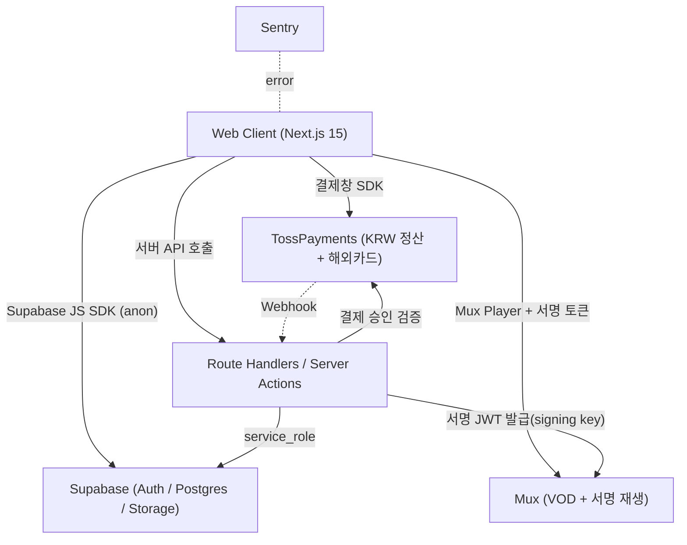
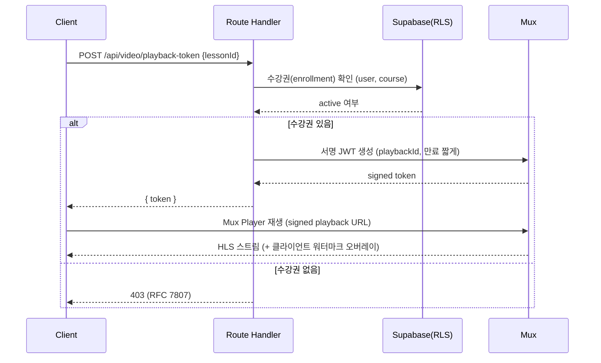

# 베이킹 온라인 클래스 플랫폼 TechSpec

> **버전**: v1.1
> **작성일**: 2026-06-08
> **최종 확정**: 2026-06-08
> **작성자**: ldH
> **PRD 참조**: 베이킹 온라인 클래스 플랫폼 PRD v1.1
> **상태**: Approved

---

## §1. Tech Stack

### 1.1 Frontend
| 영역 | 기술 | 버전 | 선택 이유 | PRD 참조 |
|------|------|------|----------|---------|
| 프레임워크 | Next.js (App Router) | 15.x | 카탈로그 SEO·SSR, RSC로 서버 로직 통합, 로케일 라우팅 | PRD-F-01, PRD-F-02, PRD-NF-01 |
| 언어 | TypeScript | 5.x | 타입 안정성 | - |
| i18n | next-intl | 3.x | App Router 호환, `/[locale]` 라우팅 기반 다국어 | PRD-F-01 |
| 서버 상태 | TanStack Query | 5.x | 클라이언트 페칭·캐싱(stale-while-revalidate) | PRD-NF-01 |
| 클라이언트 상태 | Zustand | 5.x | 플레이어/UI 로컬 상태 | PRD-F-07 |
| 스타일 | Tailwind CSS | 3.x | 빠른 반응형 UI | PRD-NF-08 |
| 영상 플레이어 | `@mux/mux-player-react` | latest | Mux 네이티브 플레이어, 서명 재생 토큰 지원 | PRD-F-06, PRD-F-07 |

### 1.2 Backend / Data
| 영역 | 기술 | 버전 | 선택 이유 | PRD 참조 |
|------|------|------|----------|---------|
| BaaS | Supabase | latest | Auth+DB+Storage+RLS 통합, 린 운영 | PRD-NF-03, PRD-G-04 |
| DB | PostgreSQL (Supabase) | 15.x | RLS 기반 행 수준 접근 제어 | PRD-NF-03 |
| 인증 | Supabase Auth | - | 이메일 + OAuth, JWT | PRD-F-03, PRD-NF-03 |
| 파일 저장 | Supabase Storage | - | 레시피 PDF·썸네일, 서명 URL | PRD-F-09 |
| 서버 로직 | Next.js Route Handlers / Server Actions | - | 결제 검증·Mux 토큰 발급(서버 전용 시크릿) | PRD-F-04.1, PRD-F-06 |
| 영상 | Mux Video | - | VOD 인코딩·적응형 스트리밍·서명 재생 URL | PRD-F-06, PRD-NF-02 |
| 결제 | TossPayments v2 | - | **KRW 정산 + 해외카드 단일 MID**(대만 카드 자동 환전), PayPal은 v1.1 옵션 | PRD-F-04 |
| 콘텐츠 | **Supabase + 운영자 콘솔** | - | 단일 브랜드·린 운영(PRD-R-06), Sanity 제거해 동기화 부담 제거, 카탈로그/마케팅 콘텐츠 Supabase 통합 | PRD-F-02, PRD-F-08 |

### 1.3 Infrastructure
| 영역 | 기술 | 선택 이유 | PRD 참조 |
|------|------|----------|---------|
| 호스팅 | Vercel | Next.js 네이티브, ISR/Edge | PRD-NF-07 |
| CDN(영상) | Mux CDN | 적응형 HLS 전송 | PRD-NF-02 |
| CDN(정적) | Vercel Edge | 페이지·자산 캐싱 | PRD-NF-01 |
| 모니터링 | Sentry + Supabase Logs | 에러·성능·RLS 거부 추적 | PRD-NF-07 |

### 1.4 Development
| 영역 | 기술 | 선택 이유 |
|------|------|----------|
| 패키지 매니저 | pnpm | 디스크 효율 |
| 테스트 | Vitest + Playwright | 단위 + E2E(결제·시청 흐름) |
| 린트/포맷 | Biome | ESLint+Prettier 대체 |
| Git 훅 | Husky + lint-staged | 커밋 게이트 |

---

## §2. System Architecture

### 2.1 구성도


### 2.2 핵심 데이터 흐름
| ID | 흐름명 | 트리거 | 경로 | PRD 참조 |
|----|--------|--------|------|---------|
| TS-ARCH-01 | 사용자 인증 | 로그인 | Client → Supabase Auth → JWT 발급 | PRD-F-03, PRD-NF-03 |
| TS-ARCH-02 | 결제 → 수강권 | 결제 완료 | 결제창 → 서버 검증(TS-API-10) → enrollment 발급 | PRD-F-04, PRD-F-05, PRD-NF-05 |
| TS-ARCH-03 | 보안 영상 재생 | 차시 진입 | 서버에서 수강권 확인 → Mux 서명 JWT 발급(TS-API-12) → Mux Player 재생 | PRD-F-06, PRD-NF-04 |
| TS-ARCH-04 | 진도 저장 | 재생 중 | Player `timeupdate` → 디바운스 → `progress` upsert | PRD-F-07 |
| TS-ARCH-05 | 자료 다운로드 | 다운로드 클릭 | 수강권 확인 → Storage 서명 URL 발급(TS-API-13) | PRD-F-09 |

### 2.3 시퀀스 다이어그램 — 보안 영상 재생 (핵심)


### 2.4 폴더 구조 (App Router)
```
src/
├── app/
│   └── [locale]/           # next-intl 로케일 라우팅 (PRD-F-01)
│       ├── (marketing)/    # 카탈로그·랜딩 (SSG/ISR)
│       ├── (learn)/        # 시청 페이지 (인증 필요)
│       ├── admin/          # 운영자 콘솔
│       └── api/            # Route Handlers (결제·토큰·webhook)
├── features/               # 기능별 모듈 (PRD-F-XX 단위)
│   ├── catalog/  checkout/  player/  enrollment/
│   ├── materials/  reviews/  admin/
│   └── (각: api/ hooks/ components/ types.ts)
├── shared/                 # 공통 컴포넌트·훅
└── lib/                    # supabase, mux, toss, sentry init
```

---

## §3. ADRs (Architecture Decision Records)

### TS-ADR-01: Next.js 15 App Router 채택 (SPA 대신)
**관련 PRD**: PRD-F-01, PRD-F-02, PRD-NF-01

**Context**: 다국어 카탈로그가 검색 노출(SEO)되어야 하고, 결제 검증·Mux 토큰 발급 등 서버 전용 시크릿을 다루는 로직이 필요하다.

**Decision**: Next.js 15 App Router + RSC로 프론트와 서버 로직을 한 코드베이스에 통합한다.

**Consequences**:
- ✅ 카탈로그 SSG/ISR로 SEO·로딩 성능 확보, 서버 시크릿 안전 처리
- ⚠️ SPA보다 러닝커브·서버/클라이언트 경계 관리 필요
- 🔄 변경 비용: 라우팅·데이터 페칭 패턴 전반 재작성 필요 (높음)

**Alternatives Considered**:
- React 18 + Vite SPA → SEO·서버 시크릿 처리에 별도 백엔드 필요해 기각
- Remix → 좋은 후보지만 Mux/Toss 생태계 예제·Vercel 통합이 Next가 우세

---

### TS-ADR-02: Supabase BaaS 채택 (커스텀 백엔드 대신)
**관련 PRD**: PRD-NF-03, PRD-G-04

**Context**: 1인·소규모 운영(PRD-R-06)이며 초기 고정비 최소화(PRD-G-04)가 목표. 인증·DB·접근제어를 빠르게 갖춰야 한다.

**Decision**: Supabase(Auth + Postgres + Storage + RLS)를 데이터/인증 백엔드로 사용한다.

**Consequences**:
- ✅ RLS로 수강권 기반 접근 제어를 DB 레벨에서 강제, 운영 부담 최소
- ⚠️ 복잡한 서버 로직은 Route Handlers로 보완 필요
- 🔄 변경 비용: 표준 Postgres라 이전 자체는 가능하나 Auth/RLS 의존도 높음 (중간)

**Alternatives Considered**:
- 직접 Node 백엔드 + 자체 DB → 인증·인가 직접 구현 부담으로 기각
- Firebase → Postgres·RLS·SQL 생태계 선호로 기각

---

### TS-ADR-03: Mux + 서명 재생 URL, DRM 미적용
**관련 PRD**: PRD-F-06, PRD-NF-04, PRD-G-04

**Context**: 영상 유출을 억제해야 하지만(PRD-G-02) 월 유지비는 최소여야 한다(PRD-G-04). 완전 차단은 불가능(PRD-R-01).

**Decision**: Mux의 단기 만료 **서명 재생 URL(JWT)**로 무단 접근을 막고, 정식 DRM은 v1.1로 보류(PRD-F-17)한다.

**Consequences**:
- ✅ DRM 애드온 비용 없이 링크 공유·핫링킹 차단, DX 우수
- ⚠️ 화면 녹화는 막지 못함 → 워터마크(TS-ADR-04)로 보완
- 🔄 변경 비용: DRM 전환은 Mux 설정·플레이어 옵션 변경으로 비교적 낮음

**Alternatives Considered**:
- Cloudflare Stream → 단가는 더 저렴하나 DX·향후 DRM 확장성에서 Mux 선택(사용자 확정)
- 처음부터 Widevine/FairPlay DRM → 월 비용 상승으로 MVP 제외

---

### TS-ADR-04: 클라이언트 오버레이 워터마크 (서버 번인 대신)
**관련 PRD**: PRD-F-06.2, PRD-G-04

**Context**: 유출 시 추적 수단이 필요하지만 서버 측 포렌식 워터마킹은 인코딩 비용이 크다.

**Decision**: 플레이어 위에 사용자 식별 정보를 **부분 마스킹**(예: `j***@e***`)한 반투명 오버레이로 표시한다.

**Consequences**:
- ✅ 추가 인코딩 비용 0, 캐주얼 재배포 억제·유출원 식별, 개인정보 마스킹으로 프라이버시 강화
- ⚠️ DOM 조작·녹화 크롭으로 우회 가능(완벽하지 않음)
- 🔄 변경 비용: 서버 번인 워터마크로 격상 가능 (중간)

**Alternatives Considered**:
- 서버 번인/포렌식 워터마크 → 비용·복잡도로 v1.1 보류
- 워터마크 없음 → 추적성 상실로 기각

---

### TS-ADR-05: TossPayments (KRW 단일 MID + 해외카드), Stripe 제외
**관련 PRD**: PRD-F-04, PRD-R-02, PRD-G-04

**Context**: 대만 우선 타깃은 카드 친화적이고, 국내 수강생도 동시 지원해야 한다. 결제 운영을 단순하게 유지하면서 비용을 최소화(PRD-G-04)해야 한다.

**Decision**: TossPayments 단일 PG로 **KRW 정산 + 해외카드 단일 MID**를 운용한다. Stripe는 한국 법인 정산 불가로 제외, PayPal은 v1.1 옵션, USD MID는 보류한다.

**Consequences**:
- ✅ **MID 하나당 통화 하나** 제약으로, KRW 단일화하면 결제·정산·회계가 단순. 대만 고객도 본인 카드사에서 자동 환전되므로 UX 손상 최소. 국내 간편결제도 통합.
- ⚠️ 해외카드 3DS 마찰(PRD-R-02) — 안내 강화로 보완
- 🔄 변경 비용: PayPal/USD MID 추가는 설정 변경(낮음), MoR 전환은 결제 모듈 재작성(높음)

**Alternatives Considered**:
- Stripe → 한국 법인 정산 불가(2026년 기준 공식 미지원). 우회 방안(해외 법인)은 글로벌 확장 시 → 기각
- PortOne/MoR(Paddle) → 통화 분기·정산이 단순하나 수수료↑(MoR ~5%+$0.50 vs Toss ~3.4%), 글로벌 본격화 전까진 과도 → v1.1 옵션
- USD 별도 MID → 결제창·정산 이중화로 복잡도만 증가 → 보류

---

### TS-ADR-06: Supabase 통합 운영자 콘솔 (CMS 대신)
**관련 PRD**: PRD-F-08, PRD-R-06, PRD-G-04

**Context**: 단일 브랜드·소규모 운영자가 클래스·차시·가격을 관리해야 한다. Sanity 같은 별도 CMS는 동기화·비용·운영 복잡도를 추가한다.

**Decision**: Supabase + Next.js 운영자 콘솔(PRD-F-08)로 카탈로그·마케팅 콘텐츠를 통합 관리한다. Sanity는 제외한다.

**Consequences**:
- ✅ 데이터 동기화 0, 비용 절감, 단일 데이터 소스, 운영자 콘솔은 어차피 빌드 필요
- ⚠️ 비기술 운영자의 콘텐츠 편집 UX는 전용 CMS만큼 매끄럽지 않을 수 있음
- 🔄 변경 비용: v1.1에서 Sanity 재도입 시 콘텐츠 마이그레이션 필요 (중간~높음)

**Alternatives Considered**:
- Sanity CMS → 마케팅 콘텐츠 분리에는 좋으나, 단일 운영자·초기 단계에선 동기화·비용 부담 → 성장 후 재검토
- 코드/MDX → 마케팅 페이지는 코드로 관리 가능, 하지만 운영자 자율 편집 불가 → 하이브리드 (콘솔 기반 + 카피는 i18n 분리)

---

### TS-ADR-07: next-intl 라우팅 기반 i18n
**관련 PRD**: PRD-F-01

**Context**: 한/영(→중) 전환과 통화·날짜 현지화가 필요하고, SEO를 위해 로케일이 URL에 드러나야 한다.

**Decision**: `next-intl`로 `/[locale]` 세그먼트 라우팅과 메시지 분리를 적용한다.

**Consequences**:
- ✅ App Router 호환, 로케일별 SSG·SEO, zh-CN 추가 용이(PRD-F-14)
- ⚠️ 메시지 카탈로그 유지 비용
- 🔄 변경 비용: 낮음 (중국어 추가는 메시지·라우팅 확장)

**Alternatives Considered**:
- 쿼리스트링/쿠키 기반 언어 → SEO 약화로 기각
- i18next → App Router 통합 성숙도에서 next-intl 우세

---

### TS-ADR-08: 서버 측 결제 검증 + Webhook 멱등 처리
**관련 PRD**: PRD-F-04.1, PRD-NF-05

**Context**: 클라이언트 응답은 위변조 가능하므로 결제 무결성을 서버에서 보장해야 한다.

**Decision**: Route Handler에서 `paymentKey`·금액·주문을 TossPayments API로 재검증한 뒤 수강권을 트랜잭션으로 발급하고, Webhook은 멱등 키로 중복 처리를 방지한다.

**Consequences**:
- ✅ 금액 조작·중복 발급 차단, 가상계좌 등 비동기 결제 보완
- ⚠️ 주문·결제·수강권 상태 머신 관리 필요
- 🔄 변경 비용: 낮음 (정책 강화 형태)

**Alternatives Considered**:
- 클라이언트 결과만 신뢰 → 보안상 즉시 기각
- Webhook 없이 동기 검증만 → 가상계좌 누락 위험으로 기각

---

## §4. API Design

### 4.1 Supabase 직접 호출
| ID | Operation | Target | 인증 | RLS | PRD 참조 |
|----|-----------|--------|------|-----|---------|
| TS-API-01 | SELECT | `courses` (published) | optional | 공개=전체, 비공개=admin | PRD-F-02 |
| TS-API-02 | SELECT | `lessons` (메타) | required | 미리보기 OR active enrollment | PRD-F-02, PRD-F-06 |
| TS-API-03 | SELECT | `enrollments` | required | 본인 소유 | PRD-F-05 |
| TS-API-04 | UPSERT | `progress` | required | 본인 소유 | PRD-F-07 |
| TS-API-05 | INSERT | `reviews` | required | 해당 course에 active enrollment | PRD-F-10 |
| TS-API-06 | INSERT/UPDATE | `courses`,`lessons` | required | role = 'admin' | PRD-F-08 |

### 4.2 RPC 함수
```sql
-- TS-API-20: 결제 검증 통과 후 수강권 발급 (트랜잭션·멱등)
create or replace function grant_enrollment(
  p_order_id uuid,
  p_user_id uuid,
  p_course_id uuid
) returns uuid
language plpgsql
security definer
as $$
declare v_enrollment_id uuid;
begin
  -- 이미 발급된 경우 기존 id 반환 (멱등)
  select id into v_enrollment_id from enrollments
   where order_id = p_order_id;
  if v_enrollment_id is not null then return v_enrollment_id; end if;

  insert into enrollments (user_id, course_id, order_id, status, granted_at)
  values (p_user_id, p_course_id, p_order_id, 'active', now())
  returning id into v_enrollment_id;
  return v_enrollment_id;
end; $$;
```

### 4.3 Route Handlers (서버 엔드포인트)
| ID | Method · Path | 책임 | 인증 | PRD 참조 |
|----|---------------|------|------|---------|
| TS-API-10 | POST `/api/payments/confirm` | 결제 서버 검증 → `grant_enrollment` 호출 | required | PRD-F-04.1, PRD-F-05 |
| TS-API-11 | POST `/api/payments/webhook` | PG Webhook 수신, 멱등 처리 | 서명 검증 | PRD-F-04.1, PRD-NF-05 |
| TS-API-12 | POST `/api/video/playback-token` | 수강권 확인 후 Mux 서명 JWT 발급 | required | PRD-F-06, PRD-NF-04 |
| TS-API-13 | POST `/api/materials/download-url` | 수강권 확인 후 Storage 서명 URL | required | PRD-F-09 |

```yaml
# TS-API-12 — OpenAPI 3.1 fragment
paths:
  /api/video/playback-token:
    post:
      operationId: TS-API-12
      security: [{ bearerAuth: [] }]
      requestBody:
        content:
          application/json:
            schema:
              type: object
              required: [lessonId]
              properties:
                lessonId: { type: string, format: uuid }
      responses:
        '200':
          description: Mux 서명 재생 토큰
          content:
            application/json:
              schema:
                type: object
                properties:
                  token: { type: string }
                  expiresIn: { type: integer }
        '403': { $ref: '#/components/responses/Problem' }
```

### 4.4 에러 응답 (RFC 7807)
```json
{
  "type": "https://api.example.com/errors/no-enrollment",
  "title": "No active enrollment",
  "status": 403,
  "detail": "이 차시를 시청할 권한이 없습니다.",
  "instance": "/api/video/playback-token"
}
```

---

## §5. Components

### 5.1 Feature Modules
| ID | 모듈명 | 책임 | 주요 의존성 | PRD 참조 |
|----|--------|------|-------------|---------|
| TS-COMP-01 | `features/catalog` | 클래스 목록·상세·미리보기 | **Supabase** (Sanity 제거) | PRD-F-02 |
| TS-COMP-02 | `features/auth` | 로그인·회원가입·세션 | Supabase Auth | PRD-F-03 |
| TS-COMP-03 | `features/checkout` | 결제창·통화 분기 | TossPayments SDK / 의존: TS-API-10 | PRD-F-04 |
| TS-COMP-04 | `features/enrollment` | 내 클래스·영구 수강권 | Supabase / 의존: TS-API-03 | PRD-F-05 |
| TS-COMP-05 | `features/player` | 보안 재생·워터마크·진도 | Mux Player / 의존: TS-API-12, TS-API-04 | PRD-F-06, PRD-F-07 |
| TS-COMP-06 | `features/admin` | 클래스·차시·영상 업로드, 가격 설정 | Supabase, Mux Upload | PRD-F-08 |
| TS-COMP-07 | `features/materials` | 레시피 PDF 다운로드 | 의존: TS-API-13 | PRD-F-09 |
| TS-COMP-08 | `features/reviews` | 후기·평점 | Supabase / 의존: TS-API-05 | PRD-F-10 |
| TS-COMP-09 | `features/dashboard` | 매출·수강·완주율 집계 | Supabase | PRD-F-11 |
| TS-COMP-10 | `app/[locale]` i18n provider | 로케일·통화·번역 | next-intl | PRD-F-01 |

### 5.2 Shared Components
| ID | 컴포넌트 | 용도 | Atomic Level |
|----|---------|------|--------------|
| TS-COMP-S1 | `<SecureVideoPlayer />` | Mux Player + 토큰 + 진도 저장 | Organism |
| TS-COMP-S2 | `<WatermarkOverlay />` | **사용자 식별 부분 마스킹**(예: `j***@e***`) 오버레이 | Molecule |
| TS-COMP-S3 | `<LocaleSwitcher />` | 언어 전환 | Molecule |
| TS-COMP-S4 | `<PriceTag />` | 통화·로케일별 가격 표시 | Atom |
| TS-COMP-S5 | `<CheckoutButton />` | 결제 트리거 | Molecule |

### 5.3 핵심 타입 정의
```typescript
// TS-COMP-01, TS-COMP-05 supports
export interface Course {
  id: string;
  slug: string;
  title: Record<Locale, string>;   // i18n (PRD-F-01)
  priceKRW: number;
  thumbnailUrl: string;
  status: 'draft' | 'published';
  lessons: Lesson[];
}

export interface Lesson {
  id: string;
  courseId: string;
  title: Record<Locale, string>;
  muxPlaybackId: string;           // 서명 재생 대상
  order: number;
  durationSec: number;
  isPreview: boolean;              // PRD-F-02
}

export interface Enrollment {
  id: string;
  userId: string;
  courseId: string;
  orderId: string;
  status: 'active' | 'refunded';
  grantedAt: string;               // 영구 (만료 없음, PRD-F-05)
}

export interface Progress {
  userId: string;
  lessonId: string;
  watchedSec: number;
  completed: boolean;
  updatedAt: string;
}
```

---

## §6. Cross-cutting Concerns

### 6.1 Security
| ID | 항목 | 구현 | PRD 참조 |
|----|------|------|---------|
| TS-SEC-01 | 인증 | Supabase Auth (이메일 + OAuth), JWT | PRD-NF-03 |
| TS-SEC-02 | 인가 | Postgres RLS — `lessons` 영상 메타는 미리보기 OR active enrollment 보유자만 SELECT | PRD-NF-03, PRD-F-06 |
| TS-SEC-03 | 영상 접근 | Mux 서명 재생 토큰(JWT, 단기 만료) 서버 발급 | PRD-NF-04, PRD-F-06 |
| TS-SEC-04 | 워터마크 | 클라이언트 오버레이, **사용자 식별자 부분 마스킹**(예: `j***@e***`) | PRD-F-06.2 |
| TS-SEC-05 | 다운로드 방지 | Mux 서명 URL + 우클릭/단축키 방어 (완전 차단 아님 명시) | PRD-F-06.1, PRD-R-01 |
| TS-SEC-06 | 결제 무결성 | 서버 금액·상태 재검증 + Webhook 멱등 | PRD-NF-05, PRD-F-04.1 |
| TS-SEC-07 | 입력 검증 | Zod 스키마 (모든 Route Handler 진입점) | - |
| TS-SEC-08 | 시크릿 관리 | Mux signing key·Toss secret·service_role은 서버 전용, 클라이언트엔 anon key만 | PRD-NF-05 |

### 6.2 Performance
| ID | 항목 | 전략 | 측정 | PRD 참조 |
|----|------|------|------|---------|
| TS-PERF-01 | 카탈로그 로딩 | SSG/ISR + Vercel Edge 캐싱 | LCP < 2.5s | PRD-NF-01 |
| TS-PERF-02 | 데이터 페칭 | TanStack Query 캐싱 (stale-while-revalidate) | TTI < 3s | PRD-NF-01 |
| TS-PERF-03 | 영상 시작 | Mux 적응형 HLS + 토큰 사전 발급 | 시작 지연 < 3s | PRD-NF-02 |
| TS-PERF-04 | 진도 저장 | `timeupdate` 디바운스(예: 10초마다 upsert) | WS/요청 부하 최소 | PRD-F-07 |
| TS-PERF-05 | DB 쿼리 | enrollment·progress 인덱스, RLS 정책 최적화 | p95 < 200ms | PRD-NF-01 |
| TS-PERF-06 | 동시 시청 | 초기 **~30명** 기준. Mux 자동 스케일, Supabase 커넥션 풀링; 확장 시 Pro 티어 상향 | 30명 동시 안정, 확장 여지 확보 | PRD-NF-09 |

### 6.3 Error Handling
| ID | 카테고리 | 전략 |
|----|---------|------|
| TS-ERR-01 | 네트워크 오류 | TanStack Query 자동 재시도(지수 백오프, max 3) |
| TS-ERR-02 | 인증 만료 | Supabase 세션 자동 갱신, 실패 시 로그인 리다이렉트 |
| TS-ERR-03 | 결제 실패 | 사유별 안내 메시지(다국어) + Sentry 기록 (PRD-R-03) |
| TS-ERR-04 | 수강권 없음(403) | 시청 페이지에서 구매 유도 CTA |
| TS-ERR-05 | UI 크래시 | React Error Boundary(feature 단위) + fallback |

### 6.4 Observability
| 항목 | 도구 | 추적 대상 |
|------|------|----------|
| 에러 | Sentry | 클라이언트/서버 에러, 결제 실패 컨텍스트 |
| 성능 | Sentry Performance | 영상 토큰 발급·결제 검증 지연 |
| 로그 | Supabase Logs | RLS 거부, RPC 호출 |
| 분석 | PostHog (선택) | PRD-M-01~05 지표 |

---

## §7. Deployment & Operations

### 7.1 환경 (Environments)
| ID | 환경 | 데이터 | 자동 배포 |
|----|------|--------|-----------|
| TS-OPS-01 | Production | 실 데이터 | main 브랜치 |
| TS-OPS-02 | Staging | seed + 익명화 | develop 브랜치 |
| TS-OPS-03 | Preview | staging DB 공유 | 모든 PR |

환경변수는 Vercel 프로젝트별로 분리(Supabase URL/anon, service_role, Mux token/signing key, Toss client/secret 등).

### 7.2 CI/CD
```
PR → typecheck → lint(Biome) → unit(Vitest) → preview deploy
merge develop → e2e(Playwright: 결제·시청 흐름) → staging
release tag → production deploy → smoke test
```

### 7.3 데이터베이스 마이그레이션
| 항목 | 정책 |
|------|------|
| 도구 | Supabase CLI migrations |
| 실행 | CI 자동 + production 수동 검토 |
| 롤백 | down migration 항상 작성 |

### 7.4 모니터링·알림
| ID | 트리거 | 채널 |
|----|--------|------|
| TS-OPS-10 | 결제 실패율 > 임계 (PRD-R-03) | Sentry → Slack |
| TS-OPS-11 | 영상 토큰 발급 오류 급증 | Sentry → Slack |
| TS-OPS-12 | 배포 실패 | Vercel → Slack |

---

## §8. Appendix

### 8.1 열린 질문
✅ **모두 해소됨** (v1.1 확정):
- [x] **결제 비교**: TossPayments(KRW 단일 MID + 해외카드) 메인, Stripe 제외(한국 정산 불가), PayPal v1.1 옵션, USD MID 보류
- [x] **CMS**: Sanity 제거 → Supabase + 운영자 콘솔 통합
- [x] **워터마크**: 부분 마스킹(예: `j***@e***`) 적용
- [x] **동시 시청**: 초기 ~30명 기준, 확장 경로(Mux 자동, Supabase Pro 상향) 마련

### 8.2 변경 이력 (v1.0 → v1.1)

**기술 스택**:
- 결제: TossPayments KRW 단일 MID + 해외카드 확정, Stripe 제외, PayPal/USD MID 보류
- 콘텐츠: Sanity 제거 → Supabase + 운영자 콘솔 통합

**아키텍처**:
- 구성도: Sanity 노드 제거
- TS-COMP-01 의존성: Sanity 제거

**보안·성능**:
- TS-SEC-04 워터마크: 부분 마스킹 명시
- TS-PERF-06 신규: 동시 시청 ~30명 baseline + 확장 경로

**ADR**:
- TS-ADR-05 갱신: KRW 단일 MID 전략, 통화 제약의 장단 명시, 대안(Stripe/MoR/USD) 기각 사유 상세
- TS-ADR-06 신규: CMS 제거 및 Supabase 통합 운영자 콘솔 선택

### 8.3 주의사항
- **KRW 단일 MID**: MID당 1통화 제약(TossPayments)으로, 대만 카드도 KRW로 청구 후 카드사에서 자동 환전. UX상 대만 화면에 "참고가" 정도로 지역 통화 환산가 표시는 가능.
- **Sanity 제거 비용**: 향후 콘텐츠 편집 UX 요구사항 높아질 경우, v1.1에서 Sanity 도입 시 마이그레이션 필요.
- **30명 동시 시청**: 초기 목표치. Mux CDN·Supabase 성능이 자동 확장 가능하므로 사실상 병목은 없음(비용만 증가).

---

## Downstream Traceability
| 문서 | 주 참조 ID | 스킬 |
|------|-----------|------|
| DBSchema | PRD-F-*, TS-API-* | `dbschema-generator` |
| UI/UX Guide | PRD-F-*, PRD-U-*, TS-COMP-* | `uxguide-generator` |

---

**다음 단계**: DBSchema 또는 UI/UX Guide 중 어느 걸 먼저 만들지 알려주세요.
